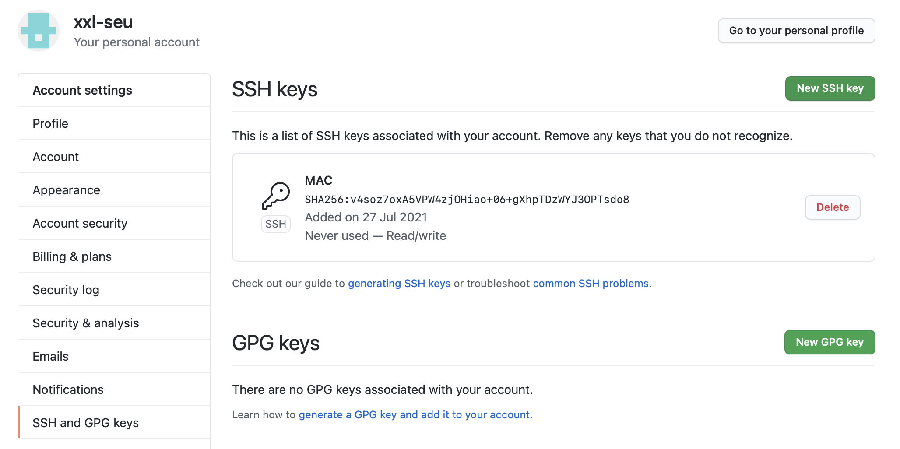
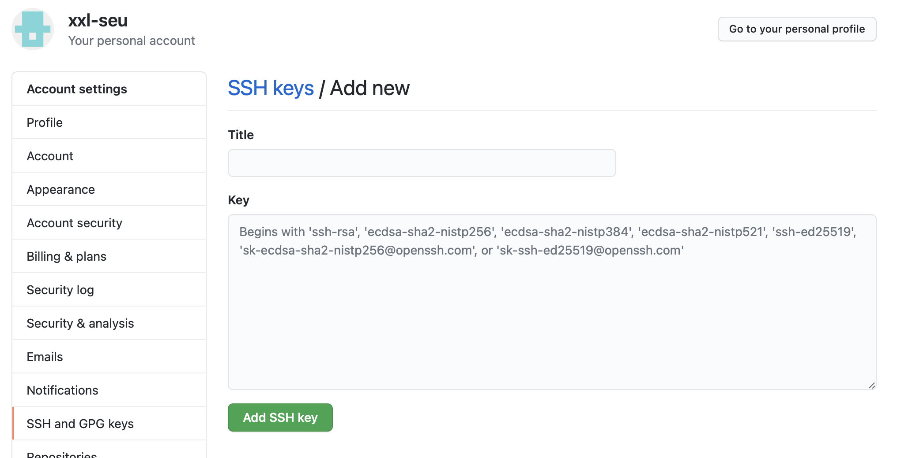
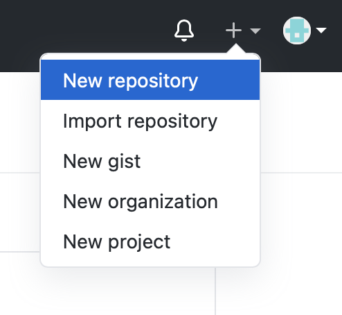
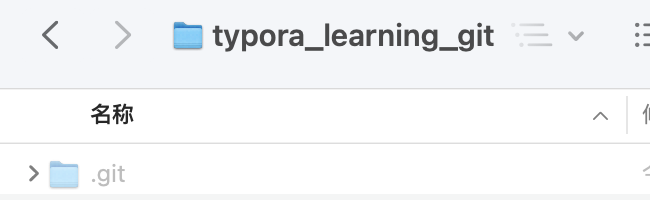

## MAC上Git安装与项目上传

## Git安装

1. 使用`git`查看是否安装过git

若安装过，则显示如下：

~~~shell
usage: git [--version] [--help] [-C <path>] [-c <name>=<value>]
           [--exec-path[=<path>]] [--html-path] [--man-path] [--info-path]
           [-p | --paginate | -P | --no-pager] [--no-replace-objects] [--bare]
           [--git-dir=<path>] [--work-tree=<path>] [--namespace=<name>]
           <command> [<args>]

These are common Git commands used in various situations:

start a working area (see also: git help tutorial)
   clone     Clone a repository into a new directory
   init      Create an empty Git repository or reinitialize an existing one

work on the current change (see also: git help everyday)
   add       Add file contents to the index
   mv        Move or rename a file, a directory, or a symlink
   restore   Restore working tree files
   rm        Remove files from the working tree and from the index

examine the history and state (see also: git help revisions)
   bisect    Use binary search to find the commit that introduced a bug
   diff      Show changes between commits, commit and working tree, etc
   grep      Print lines matching a pattern
   log       Show commit logs
   show      Show various types of objects
   status    Show the working tree status

grow, mark and tweak your common history
   branch    List, create, or delete branches
   commit    Record changes to the repository
   merge     Join two or more development histories together
   rebase    Reapply commits on top of another base tip
   reset     Reset current HEAD to the specified state
   switch    Switch branches
   tag       Create, list, delete or verify a tag object signed with GPG

collaborate (see also: git help workflows)
   fetch     Download objects and refs from another repository
   pull      Fetch from and integrate with another repository or a local branch
   push      Update remote refs along with associated objects

'git help -a' and 'git help -g' list available subcommands and some
concept guides. See 'git help <command>' or 'git help <concept>'
to read about a specific subcommand or concept.
See 'git help git' for an overview of the system.
~~~

2. 若未安装

可通过homebrew和Xcode安装（自行百度）

## Git配置

1. 设置username和email（github每次commit都会记录他们）

   ~~~shell
   git config --global user.name "xxl-seu"
   git config --global user.email "617528089@qq.com"
   ~~~

2. 通过终端命令创建ssh key

   ~~~shell
   ssh-keygen -t rsa -C "617528089@qq.com"
   ~~~

   回车会有以下输出

   ~~~shell
   Generating public/private rsa key pair.
   Enter file in which to save the key (/Users/mac/.ssh/id_rsa): 
   ~~~

   输入自定义密码两次后有如下输出

   ~~~shell
   Enter passphrase (empty for no passphrase): 
   Enter same passphrase again: 
   Your identification has been saved in /Users/mac/.ssh/id_rsa.
   Your public key has been saved in /Users/mac/.ssh/id_rsa.pub.
   The key fingerprint is:
   SHA256:v4soz7oxA5VPW4zjOHiao+06+gXhpTDzWYJ3OPTsdo8 617528089@qq.com
   The key's randomart image is:
   +---[RSA 3072]----+
   |  .              |
   | o + . o         |
   |= * O + o        |
   | B & = +         |
   |  O * = S        |
   |   B o o .       |
   |  + = E . .      |
   |.o o.= . . .     |
   |==+ o=+ . o.     |
   +----[SHA256]-----+
   ~~~

3. 使用cat命令查看key

   ~~~shell
   cat .ssh/id_rsa.pub
   ~~~

   得到完整key（由ssh-rsa等开头）

   ~~~shell
   ssh-rsa AAAAB3NzaC1yc2EAAAADAQABAAABgQDTLFDjRron+uVjOQDwj3e/W3H3Xes9ZRC/5RAZQ8KXuQ7T6FjuD1Kvt8z0btOj9nfhGw+Imc4DksduVdPC+2rdPQ+H/gginZ3+ou9Zeqroq28C7q+q1eOfeXrlMGj9FdbLAVrDbLC0KGK8iGwaCVGGJ14mPSSshEWCM+XCne38RAljZIQcoP8X8Qz19t6a2lbtgsk36lDWnTt2Kr7Dc/BG5zD1Zk36WN8v8v3s7h4OcP3L6e9f5m0orIPlqlmidCojcJYDc3D3YX1RkPy4GBjvhZn0NjBanGfH2RXw6vaqkuLutrU6oC0vvOJRRfdWn5bZeGaHHygls0YIOnmfea/aIztPDDlkvb0X+StLYXRdUtN33btZXN8fS3IiVRstxPL8R3R34apRFpU6qdlqpaRZrlqK5lhwvXTQeU7865eYFz1WI67K2LJW7JTmJh4cKqSLoE0fe24/7MWlf+9mcniXRbwUlFs86tLvlwVo/PLsf5mrPYgSLmXzJVV7+if1kTM= 617528089@qq.com
   ~~~

4. 登陆GitHub添加ssh key

   点击Settings

​			进入SSH and GPG Keys，点击New SSH Key

​			输入Title，复制上一步骤中的Key

5. 验证链接

   ~~~shell
   ssh -T git@github.com
   ~~~

   得到

   ~~~shell
   Warning: Permanently added the RSA host key for IP address '140.82.114.4' to the list of known hosts.
   Enter passphrase for key '/Users/mac/.ssh/id_rsa': 
   Hi xxl-seu! You've successfully authenticated, but GitHub does not provide shell access.
   ~~~

   输入自定义的密码，链接成功

## 项目提交

1. GitHub中新建仓库，并复制仓库中的https地址

   点击New repository

   

   创建文件

   

   复制HTTPS地址

   

2. 在shell中进入想存放项目文件夹的的文件夹后，输入

   ~~~shell
   git clone https://github.com/xxl-seu/typora_learning_git.git
   ~~~

   出现文件夹下出现目标文件夹，其中包含.git

   

3. 将要传输的文件放在目标文件夹下，Shell进入目标文件夹，依次输入

   ~~~shell
   //文件添加到仓库（.代表提交所有文件）
   git add *
   //把文件提交到仓库
   git commit -m "First Commit"
   //上传到github
   git push -u origin master
   ~~~

   输入用户名和密码，等待上传完成

   ~~~shell
   Username for 'https://github.com': xxl-seu
   Password for 'https://xxl-seu@github.com': 
   Enumerating objects: 6, done.
   Counting objects: 100% (6/6), done.
   Delta compression using up to 4 threads
   Compressing objects: 100% (5/5), done.
   Writing objects: 100% (6/6), 221.99 KiB | 15.86 MiB/s, done.
   Total 6 (delta 0), reused 0 (delta 0)
   To https://github.com/xxl-seu/typora_learning_git.git
    * [new branch]      master -> master
   Branch 'master' set up to track remote branch 'master' from 'origin'.
   ~~~